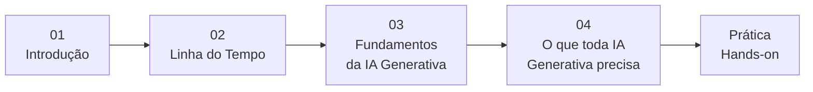

# Engenharia de Software na Era da IA

> **O dev trocou o carro manual (IDE) pela Ferrari (IA Generativa) — mas ainda é o piloto.**

Ter uma Ferrari na garagem não faz ninguém piloto de Fórmula 1. Da mesma forma, ter acesso a IA generativa não transforma automaticamente qualquer pessoa em engenheiro de software. A ferramenta mudou — e mudou muito —, mas o raciocínio, a clareza de requisitos e a responsabilidade sobre o resultado continuam sendo do desenvolvedor.

Este repositório é um material de **Letramento de IA** para profissionais de tecnologia: entender o que mudou, o que não mudou, e como tirar o melhor dessa nova era.

---

## A Analogia

| Antes | Agora | Constante |
|-------|-------|-----------|
| Carro manual (IDE tradicional) | Ferrari (IA Generativa) | O piloto (dev) |
| Trocar marcha na mão (escrever tudo) | Câmbio automático (auto-complete IA) | Saber para onde ir (requisitos) |
| Mapa de papel (documentação offline) | GPS inteligente (contexto dinâmico) | Decidir a rota (arquitetura) |
| Mecânico faz tudo (dev full manual) | Pit stop automatizado (agentes + MCP) | Estratégia de corrida (design) |

**A mensagem central:** a IA generativa é a maior evolução de ferramental que a engenharia de software já viu, mas ela amplifica a competência — não a substitui. Um bom piloto com uma Ferrari vence corridas. Um mau piloto com uma Ferrari bate no muro mais rápido.

---

## Conteúdo

O material está organizado em seções progressivas:



### Teoria

| # | Seção | O que cobre |
|---|-------|-------------|
| 01 | [Introdução](ptbr/01-introdução.md) | Linguagem natural vs linguagem de programação — a base para entender prompts |
| 02 | [Linha do Tempo](ptbr/02-linha-do-tempo.md) | Do editor de texto (antes de 2000) ao contexto adaptativo (2026+) |
| 03 | [Fundamentos da IA Generativa](ptbr/03-fundamentos-ia-generativa.md) | IA Generativa, Modelos, LLMs, Tokens e RAG |
| 04 | [O que toda IA Generativa precisa](ptbr/04-o-que-toda-ia-generativa-precisa.md) | Os 8 componentes: Modelo, Prompt, Contexto, Skills, Agents, Hooks, Orquestração e MCP |

### Prática (Hands-on)

Exercícios comparativos construindo o jogo **Snake** com diferentes abordagens — para ver na prática a diferença que skills e prompts bem escritos fazem:

| Ferramenta | Sem Skill | Com Skill | Com Skill + Prompt Detalhado |
|------------|-----------|-----------|------------------------------|
| **Kiro** | [Snake sem skill](ptbr/01-pratica-com-kiro/snake-sem-skill/) | [Snake com skill](ptbr/01-pratica-com-kiro/snake-com-skill/) | [Snake detalhado](ptbr/01-pratica-com-kiro/snake-com-skill-detalhado/) |
| **GitHub Copilot** | [Snake sem skill](ptbr/02-pratica-com-github-copilot/snake-sem-skill/) | [Snake com skill](ptbr/02-pratica-com-github-copilot/snake-com-skill/) | — |

O objetivo é comparar: **mesmo prompt, ferramentas diferentes, com e sem direcionamento (skill)**. O resultado mostra que a qualidade da saída depende diretamente da qualidade da entrada — exatamente como um piloto que conhece a pista extrai mais do carro.

---

## Estrutura do Repositório

```
├── README.md                          ← Você está aqui
├── ptbr/
│   ├── 00-roteiro.md                  ← Roteiro geral da apresentação
│   ├── 01-introdução.md               ← Linguagem, sintaxe e semântica
│   ├── 02-linha-do-tempo.md           ← Evolução: editor → IDE → IA
│   ├── 03-fundamentos-ia-generativa.md ← IA Generativa, LLM, Tokens
│   ├── 04-o-que-toda-ia-generativa-precisa.md ← 8 componentes essenciais
│   ├── 01-pratica-com-kiro/           ← Exercícios com Kiro
│   ├── 02-pratica-com-github-copilot/ ← Exercícios com GitHub Copilot
│   └── imagens/                       ← Recursos visuais
```

---

## Resumo Rápido

**O que toda IA Generativa precisa (os 8 componentes):**

| Componente | Analogia com o carro | Papel |
|------------|---------------------|-------|
| **Modelo/LLM** | Motor | Processa e gera linguagem |
| **Engenharia de Prompt** | Volante | Como você comunica a direção |
| **Engenharia de Contexto** | Regulagem do carro | Regras fixas que guiam o comportamento |
| **Skills** | Modos de direção (sport, eco) | Capacidades reutilizáveis |
| **Custom Agents** | Equipe de mecânicos | Especialistas por domínio |
| **Agent Hooks/Workflow** | Pit stop automatizado | Automação de tarefas recorrentes |
| **Orquestração** | Diretor de corrida | Coordena quem faz o quê |
| **MCP** | Telemetria + rádio | Conecta o sistema ao mundo externo |

**Métodos de trabalho:**

| Método | Descrição | Quando usar |
|--------|-----------|-------------|
| **Antes da IA** | Análise → Design → Código → Testes (tudo manual) | Linha de base, entender o processo |
| **Vibe Coding** | Iteração rápida com IA, pouco planejamento | Protótipos, exploração, MVPs |
| **Spec-driven** | Requisitos claros → Design → Tarefas → Execução com IA | Produção, projetos reais |

---

## Para quem é este material?

- Desenvolvedores que querem entender **como** (e não só **se**) usar IA generativa
- Tech leads que precisam orientar seus times sobre boas práticas com IA
- Qualquer profissional de tecnologia que quer separar hype de realidade

---

> *"A IA não vai substituir programadores. Programadores que usam IA vão substituir programadores que não usam."*
>
> Mas só se o programador souber pilotar.