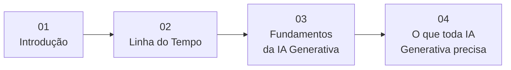

# Roteiro: Letramento de IA

Este documento apresenta o roteiro completo da apresentação, organizando os temas abordados nas seções 01 a 04 de forma sequencial e conectada.

---

## Visão Geral

---