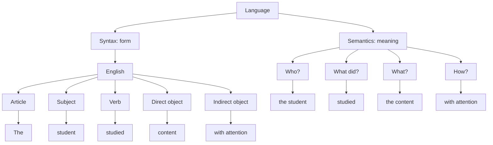
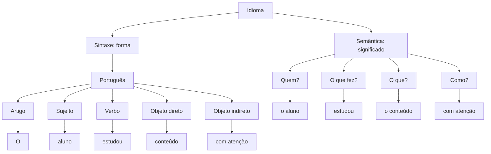
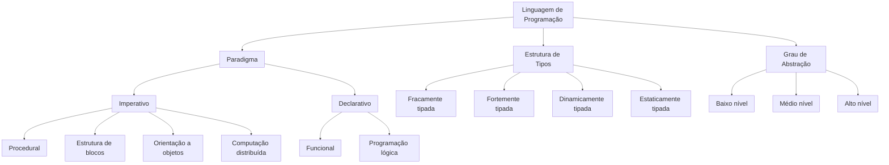
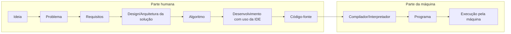
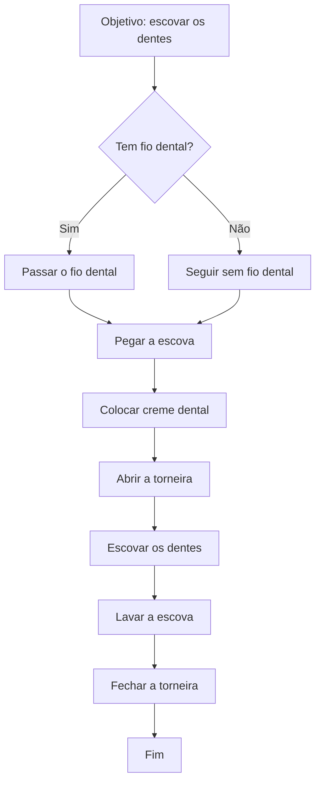

# Introdução

Esta introdução abre a apresentação sobre Letramento de IA.

Antes de entrar em IA generativa, é útil lembrar que toda linguagem (natural ou de programação) tem estrutura. Todo idioma costuma seguir a estrutura de artigo, sujeito, verbo e objetos, e chamamos isso de sintaxe. Isso não é só forma: é a base para o significado. Em computação, a ideia é parecida: toda linguagem tem sintaxe (as regras de escrita) e semântica (o que aquilo significa).

## Idioma (exemplo)

#### Language (English): "The student studied the content with attention."

#### Idioma (PT-BR): "O aluno estudou o conteúdo com atenção."

## Linguagem de programação (visão geral)

Assim como no idioma, linguagens de programação têm partes fixas e regras claras. Em geral, toda linguagem possui declaração de variáveis, funções ou métodos, e segue um ou mais paradigmas. Além disso, pode ser classificada por tipos, grau de abstração e geração.

Com essa base, fica mais fácil entender IA generativa como uma tecnologia que aprende a produzir linguagem (texto, código, imagens e áudio) seguindo regras, contexto e significado.

## Fluxo tradicional de desenvolvimento (antes da IA)

Antes da IA generativa, o caminho mais comum para transformar uma ideia em software era mais linear e manual: entender o problema, detalhar requisitos, desenhar a solução, escrever o código e testar. Esse fluxo reforça a importância da clareza de objetivos e da comunicação entre pessoas, pois o computador executa exatamente o que foi especificado.

## Por que o algoritmo é tão importante

O algoritmo é o passo a passo que transforma uma intenção em uma sequência executável. Ele organiza o raciocínio, reduz ambiguidades e permite que a mesma tarefa seja repetida com consistência. Em outras palavras, sem algoritmo não existe software confiável: existe só uma ideia vaga que a máquina não consegue executar.

