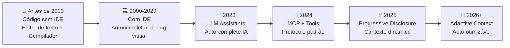
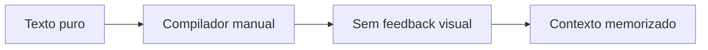
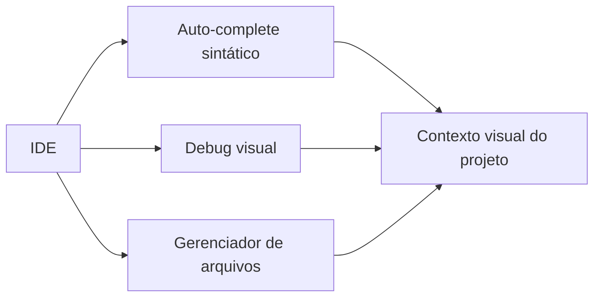
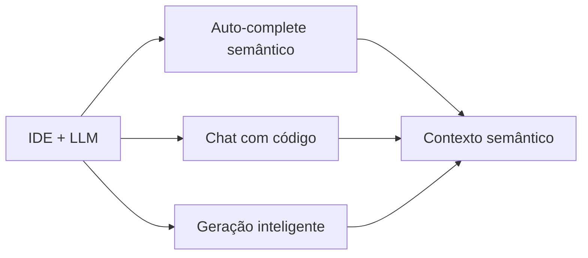
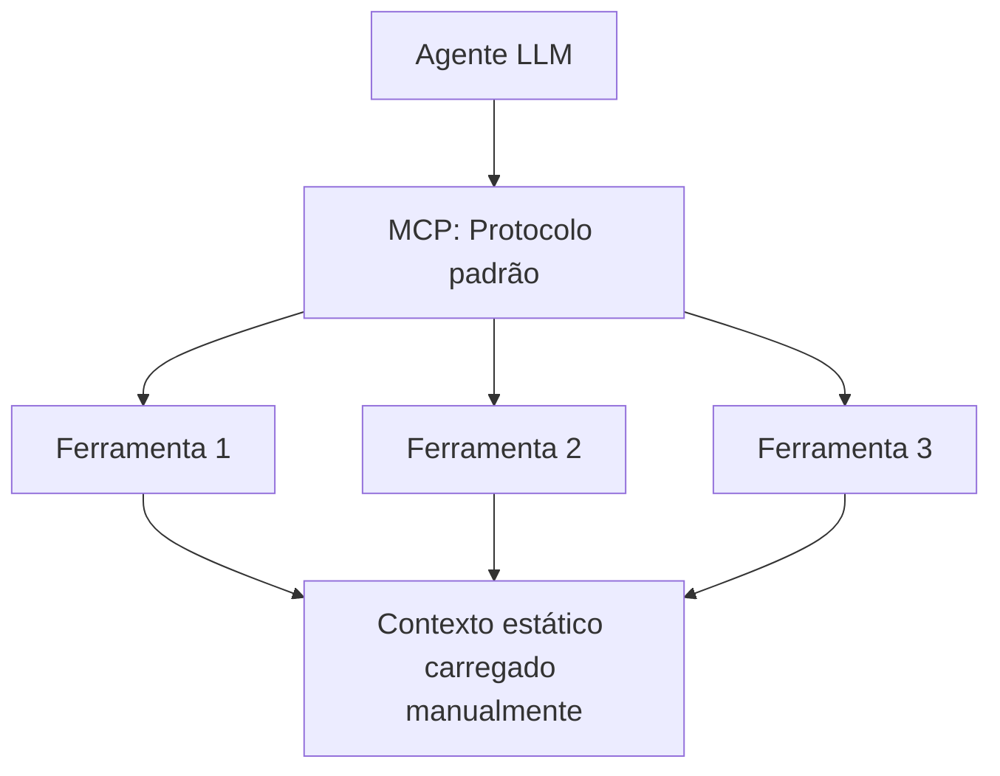
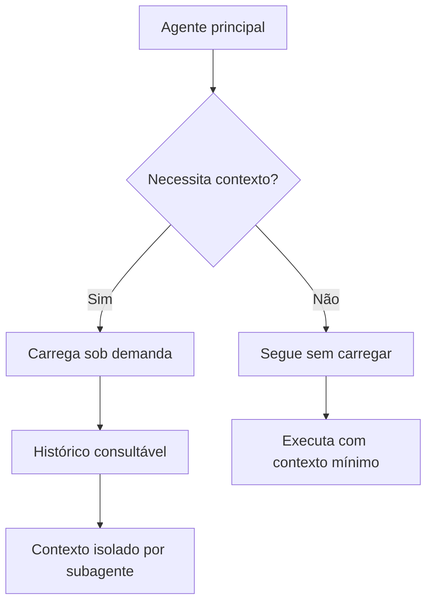
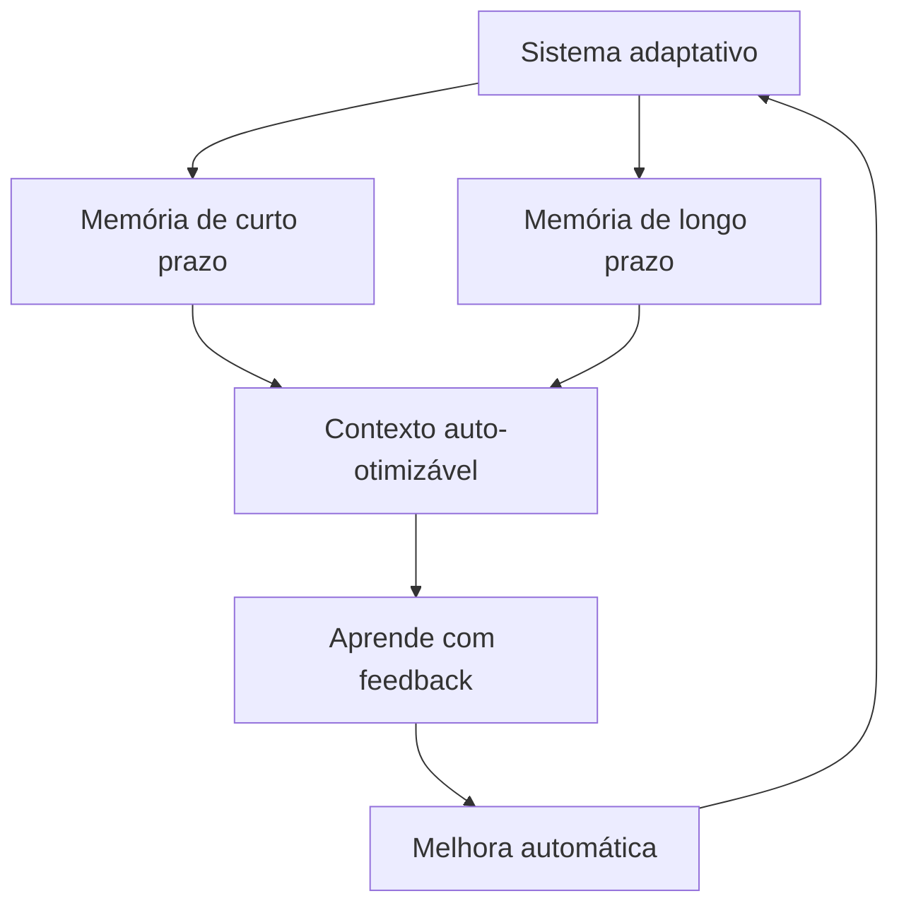

# Linha do tempo: evolução do desenvolvimento de software

Esta seção mapeia a evolução completa: desde código sem IDE, passando pela era das IDEs, até a IA generativa adaptativa.

## Linha do tempo visual

## Antes de 2000: código sem IDE

Desenvolvimento puro em editor de texto (Vim, Emacs) com compilador manual. Sem autocompletar, sem debug visual, sem contexto automático.

**Características:**
- Editor de texto simples
- Compilação manual via terminal
- Documentação em papel ou HTML
- Todo o contexto na cabeça do desenvolvedor
- Sem controle visual de erros

## 2000-2020: era da IDE (Integrated Development Environment)

Surgem as IDEs modernas (Visual Studio, Eclipse, IntelliJ). Autocompletar baseado em sintaxe, debug visual, gestão de projetos integrada.

**Características:**
- Autocompletar baseado em árvore sintática
- Debug visual com breakpoints
- Gerenciador de projetos integrado
- Contexto organizado em abas e painéis
- Erro em tempo real (warnings/erros)

## 2023: LLM Assistants (auto-complete com IA)

Surgem GitHub Copilot, ChatGPT, Claude. Auto-complete agora usa redes neurais treinadas em bilhões de linhas de código. Contexto passa a ser entendido semanticamente.

**Características:**
- Auto-complete com IA (padrões aprendidos)
- Chat com o código
- Entendimento semântico, não só sintático
- Geração de funções/classes inteiras
- Contexto da sessão atual (histórico)

**Exemplo: GitHub Copilot em 2023**
- Contexto: arquivo aberto + histórico de escrita
- Saída: linha/função sugerida
- Limite: tudo precisa ser carregado/revisado

## 2024: Tool Use + MCP (ferramentas estáticas com protocolo padrão)

Em 2024, surgem os primeiros padrões de conexão entre agentes e ferramentas. O MCP (Model Context Protocol) estabelece um padrão para que LLMs acessem ferramentas de forma consistente. O contexto ainda é basicamente estático, mas agora pode ser compartilhado estruturadamente.

**Características:**
- Ferramentas com descritores completos
- Protocolo padrão (MCP)
- Contexto ainda manualmente carregado
- Agentes com ferramentas fixas

**Vantagens:**
- Padronização entre ferramentas
- Melhor integração com LLMs
- Contexto estruturado

**Limitações:**
- Contexto ainda manual
- Sem adaptação automática
- Sem memória hierárquica

## 2025: Progressive Disclosure (contexto dinâmico carregado sob demanda)

Em 2025, o contexto se torna dinâmico. Em vez de carregar tudo de uma vez, o sistema carrega contexto sob demanda. Ferramentas como "lazy loading" de agentes e histórico consultável transformam como usamos contexto.

**Características:**
- Carregamento sob demanda (lazy loading)
- Subagentes com contexto isolado
- Histórico consultável como arquivo
- Contexto progressivo (começa mínimo, expande conforme necessário)

**Vantagens:**
- Menos desperdício de tokens
- Contexto mais relevante
- Melhor escalabilidade

## 2026+: Adaptive Context (contexto auto-otimizável)

A partir de 2026, o contexto se torna verdadeiramente adaptativo. O sistema otimiza automaticamente o que precisa de contexto, cria memória hierárquica e aprende com o uso.

**Características:**
- Orquestração multi-agente inteligente
- Contexto auto-otimizável
- Memória hierárquica (curta/longa prazo)
- Contexto aprende com uso

**Vantagens:**
- Menos intervenção manual
- Contexto sempre relevante
- Melhoria contínua

## Resumo: Evolução do contexto

| Período | Nome | Contexto | Adaptação | Escalabilidade |
|---------|------|----------|-----------|---|
| Antes de 2023 | Manual | Estático/Manual | Nenhuma | Baixa |
| 2024 | Tool Use + MCP | Estático/Padrão | Manual | Média |
| 2025 | Progressive Disclosure | Dinâmico/Sob demanda | Parcial | Alta |
| 2026+ | Adaptive Context | Adaptativo/Auto-otimizável | Automática | Muito alta |

