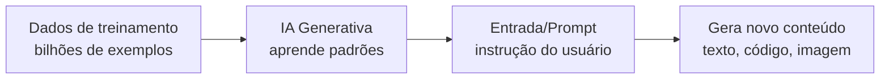
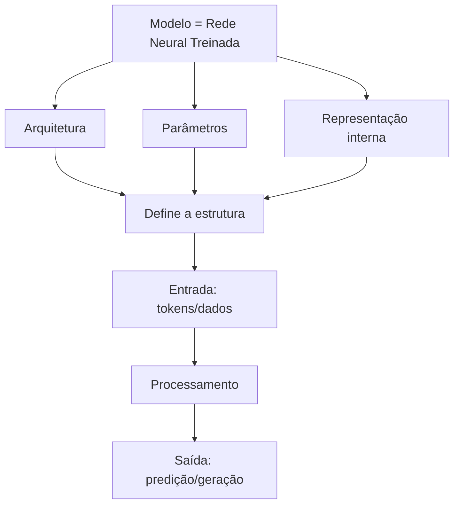
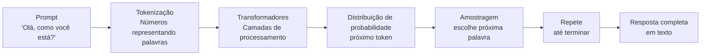
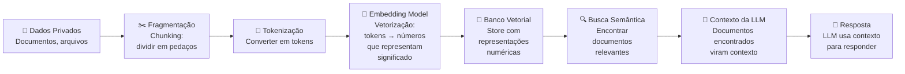
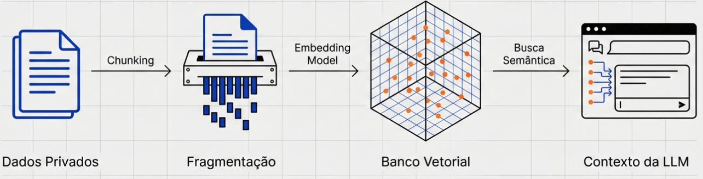

# Fundamentos da IA Generativa: o que precisa

Esta seção apresenta os conceitos fundamentais para entender como a IA generativa funciona: o que é IA generativa, o que é um modelo, o que é LLM, e como se relacionam.

## O que é IA Generativa?

IA Generativa é um tipo de inteligência artificial capaz de **gerar novo conteúdo** a partir de padrões aprendidos em dados de treinamento. Diferentemente de sistemas que apenas classificam ou predizem, a IA generativa cria:

- Texto (respostas, histórias, código)
- Imagens (desenhos, fotos)
- Áudio (voz, música)
- Vídeo
- Código de programação

**Característica central:** ela aprende a distribuição de probabilidade de dados e pode amostrar (gerar) novos dados seguindo essa distribuição.

**Exemplo:** Um sistema que aprendeu com bilhões de linhas de código pode escrever novas linhas de código que parecem naturais e funcionam.



## O que é um Modelo?

Um **modelo** é uma representação matemática (rede neural) treinada para executar uma tarefa. Pode ser pensado como:

- Um arquivo que contém "conhecimento"
- Um conjunto de parâmetros (pesos) aprendidos
- Uma função que mapeia entrada → saída

**Componentes:**
- **Arquitetura:** a estrutura da rede (como os neurônios estão conectados)
- **Parâmetros:** os pesos aprendidos durante treinamento
- **Tokenização:** forma de representar dados (ex: palavras quebradas em tokens)

**Analogia:** Se IA Generativa é a capacidade, um modelo é a implementação específica dessa capacidade.



## O que é LLM (Large Language Model)?

Um **LLM** é um **modelo grande de linguagem**. É um tipo específico de modelo generativo especializado em entender e gerar texto.

**"Large"** (grande) significa:
- Bilhões de parâmetros (claude-3-opus tem centenas de bilhões)
- Treinado em centenas de bilhões de tokens (palavras/caracteres)
- Requer GPU/TPU poderoso para treinar e executar

**"Language Model"** (modelo de linguagem) significa:
- Aprendeu a prever a próxima palavra/token dado o contexto anterior
- Segue regras de sintaxe e semântica
- Entende relacionamentos entre conceitos

### Como um LLM funciona

1. Recebe um prompt (texto)
2. Converte para tokens (números)
3. Processa através de camadas de transformadores
4. Gera uma distribuição de probabilidade para o próximo token
5. Amostra o token mais provável (ou segundo mais provável, etc.)
6. Repete até terminar ou atingir limite



## O que são Tokens?

Um **token** é a unidade básica que um LLM processa. Não é simplesmente uma palavra. O LLM quebra o texto em pedaços menores que podem ser:

- **Palavras completas:** "Olá" = 1 token
- **Partes de palavras:** "programação" = 2-3 tokens (programa + ção)
- **Caracteres especiais:** "!" = 1 token
- **Espaços:** podem formar tokens sozinhos

### Por que quebrar em tokens?

1. **Eficiência:** Reduz tamanho da entrada/saída
2. **Aprendizado:** O modelo aprendeu a trabalhar com tokens, não palavras brutas
3. **Padronização:** Diferentes idiomas têm comprimentos diferentes; tokens normalizam
4. **Custo:** A cobrança de APIs (como Claude) é feita por token, não por palavra

### Exemplos de tokenização

| Texto original | Tokens | Número de tokens |
|---|---|---|
| "Olá" | `Olá` | 1 |
| "Olá, mundo!" | `Olá`, `,`, ` mundo`, `!` | 4 |
| "Programação" | `Program`, `ação` | 2 |
| "API" | `API` | 1 |
| "def função( ):" | `def`, ` função`, `(`, `)`, `:` | 5 |
| "IA generativa é poderosa" | `IA`, ` generativa`, ` é`, ` poderosa` | 4 |
| "função_com_nome_longo()" | `função`, `_com`, `_nome`, `_longo`, `()` | 5 |

### Fluxo: do dado privado ao contexto da LLM

Quando você quer usar dados privados com um LLM (como documentos da sua empresa), o fluxo segue:





*Diagrama visual do fluxo: Dados Privados → Fragmentação → Embedding Model → Banco Vetorial → Busca Semântica → Contexto da LLM*

**Detalhamento do fluxo:**

1. **Fragmentação (Chunking):** Divide documentos grandes em pedaços menores (~1000 tokens cada)
2. **Tokenização:** Cada fragmento vira tokens
3. **Embedding:** Uma rede neural converte tokens em vetores (números que representam **significado**)
4. **Banco Vetorial:** Armazena esses vetores para busca rápida
5. **Busca Semântica:** Quando você faz uma pergunta, ela é convertida em vetor e comparada com os outros (números similares = significados similares)
6. **Contexto:** Os fragmentos mais relevantes viram contexto do LLM
7. **Resposta:** O LLM responde usando o contexto (não alucinando sobre dados que não tem)

### Relação: Tokens ↔ Contexto

- **Contexto disponível** para Claude = ~100.000 tokens
- Cada token tem custo (entrada e saída são cobradas por token)
- Uma página de texto ≈ 250-300 palavras ≈ 300-500 tokens
- Um documento de 100 páginas ≈ 30-50K tokens

**Implicação:** Da próximo pergunta ao seu LLM, você pode fornecer contexto vastíssimo (um livro inteiro, código fonte completo, base de conhecimento) e o LLM lê tudo.

### Exemplos de LLMs

| Nome | Criador | Tamanho | Capacidade |
|------|---------|--------|-----------|
| **Claude 4** | Anthropic | ~300B parâmetros | Raciocínio avançado, multimodal |
| **GPT-5** | OpenAI | ~2T+ parâmetros | Versátil, multi-modal, reasoning |
| **Gemini 3.1** | Google | Varia (até 500B) | Integrado com Google, long context |
| **LLaMA 4** | Meta | Varia (7B até 100B) | Open-source, eficiente |

## Tabela Comparativa: IA Generativa vs Modelo vs LLM

| Aspecto | IA Generativa | Modelo | LLM |
|--------|--------------|--------|-----|
| **O quê é** | Capacidade de gerar novo conteúdo | Implementação matemática treinada | Tipo específico de modelo |
| **Escopo** | Geral (texto, imagem, áudio, etc.) | Específico para uma tarefa | Especializado em linguagem |
| **Entrada** | Qualquer dados | Dados estruturados (imagens, texto, números) | Apenas texto (linguagem natural) |
| **Saída** | Novo conteúdo similar aos dados de treino | Predição ou classificação | Texto gerado token-por-token |
| **Tamanho** | Pode ser pequeno ou grande | Pequeno a grande | **Sempre grande** (bilhões de parâmetros) |
| **Exemplo** | Conceito guarda-chuva | Claude, DALL-E, Whisper | Claude 4, GPT-5, LLaMA 4 |
| **Treinamento** | Aprender distribuição de dados | Otimizar pesos para tarefa | Prever próximo token em texto |

## Relação entre os três conceitos

```
IA Generativa (categoria geral)
    ↓
    ├─ Modelos generativos de imagem (DALL-E, Stable Diffusion)
    ├─ Modelos generativos de áudio (Whisper, MusicLM)
    └─ Modelos generativos de linguagem ← Aqui está o LLM
         ├─ LLaMA 4 (Meta)
         ├─ GPT-5 (OpenAI)
         └─ Claude 4 (Anthropic) ← Nosso foco
```

## Por que LLMs são importantes?

1. **Versatilidade:** Um LLM pode fazer múltiplas tarefas (tradução, resumo, código, análise)
2. **Emergência:** Comportamentos não previstos aparecem com modelos maiores
3. **Few-shot learning:** Aprende novas tarefas com poucos exemplos
4. **Contexto longo:** Pode analisar documentos inteiros (contexto de 100K+ tokens)
5. **Alinhamento:** Podem ser treinados para ser úteis, honestos e inofensivos

---

## Fontes oficiais Anthropic

Para aprender mais sobre IA generativa e LLMs, consulte:

- **Claude API Documentation:** https://platform.claude.com/docs
- **Anthropic Research:** https://www.anthropic.com/research
- **Anthropic Academy (Cursos):** https://www.anthropic.com/learn
- **Claude Models Overview:** https://www.anthropic.com/claude/models
- **Responsible Scaling Policy:** https://www.anthropic.com/news/announcing-our-updated-responsible-scaling-policy
- **Constitutional AI Research:** https://www.anthropic.com/constitution

### Documentação técnica
- **Anthropic API Reference:** https://platform.claude.com/docs/en/api/overview
- **Claude Cookbook (exemplos):** https://platform.claude.com/cookbooks
- **Transformer basics (base teórica):** "Attention is All You Need" - Vaswani et al., 2017

