# O que toda IA generativa precisa

Esta seção apresenta os componentes essenciais para construir e usar sistemas de IA generativa. Assim como toda linguagem de programação tem estrutura básica, toda IA generativa precisa de elementos fundamentais para funcionar.

## Analogia: Linguagem de Programação (revisão)

Antes de vermos a estrutura da IA generativa, vamos relembrar como toda linguagem de programação se organiza em três dimensões principais:

### Estrutura das Linguagens de Programação

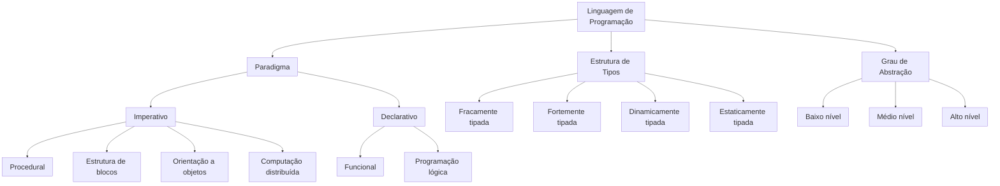

Da mesma forma, a IA generativa possui uma estrutura modular com componentes que se organizam hierarquicamente.

---

## Anatomia da IA Generativa (2025+)

Assim como linguagens de programação têm paradigmas, tipos e níveis de abstração, sistemas de IA generativa têm sua própria arquitetura de componentes:

### Visão Geral: 8 Componentes Essenciais

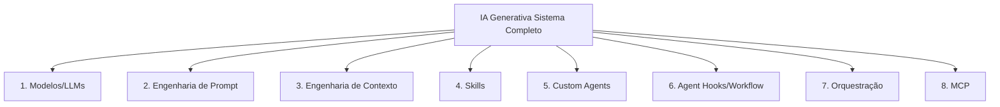

### 1. Modelos/LLMs (Motor de Linguagem)

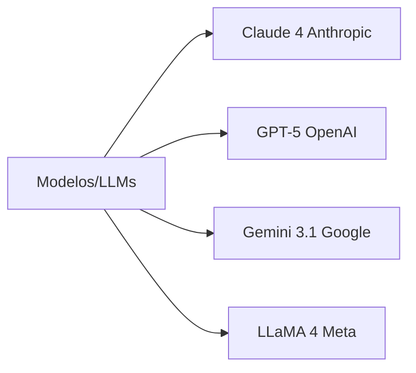

### 2. Engenharia de Prompt (Comunicação)

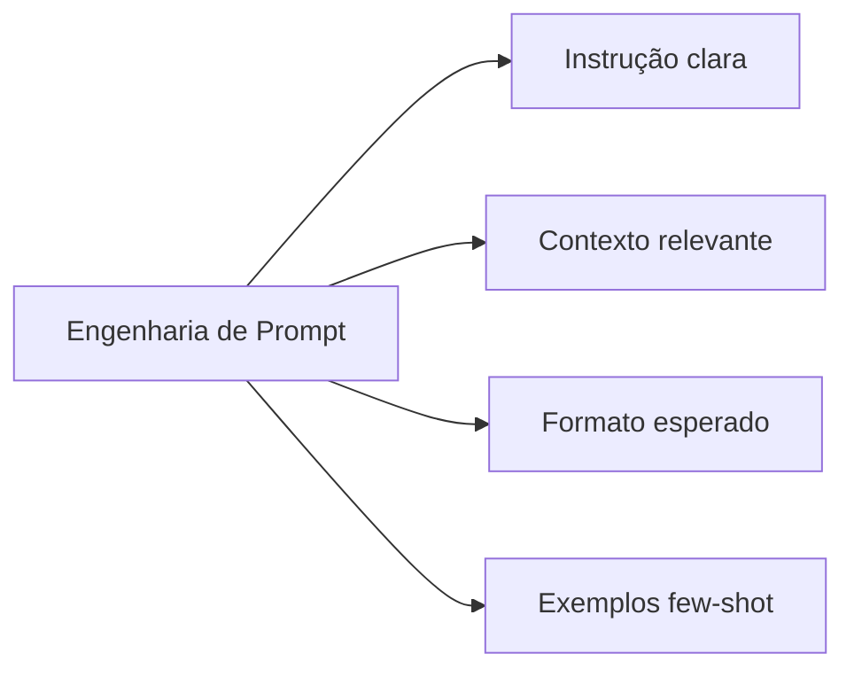

### 3. Engenharia de Contexto (Regras Fixas)

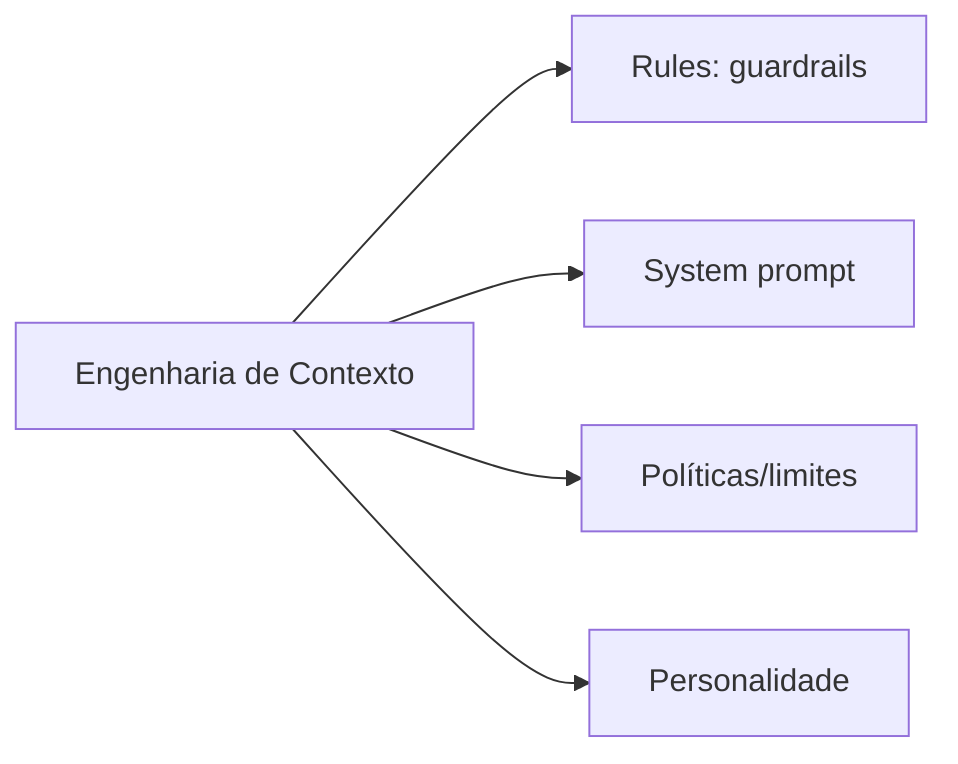

### 4. Skills (Capacidades Reutilizáveis)

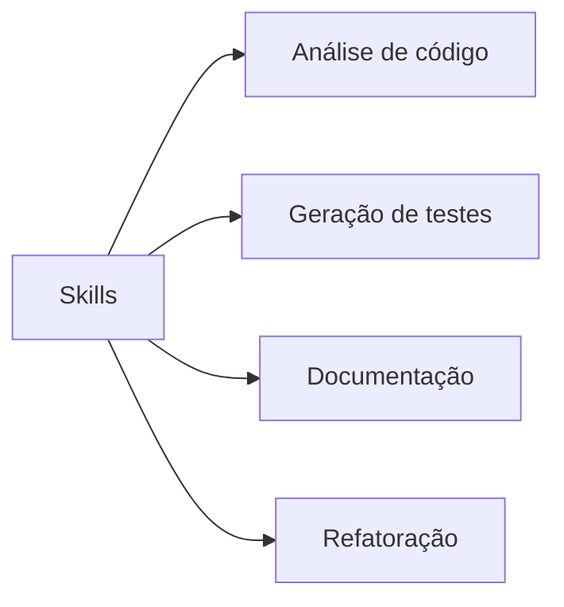

### 5. Custom Agents (Especialização)

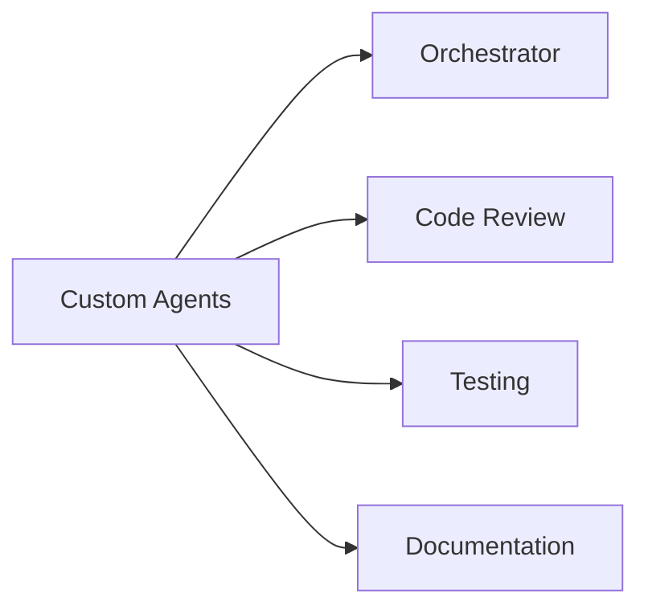

### 6. Agent Hooks/Workflow (Automação Recorrente)

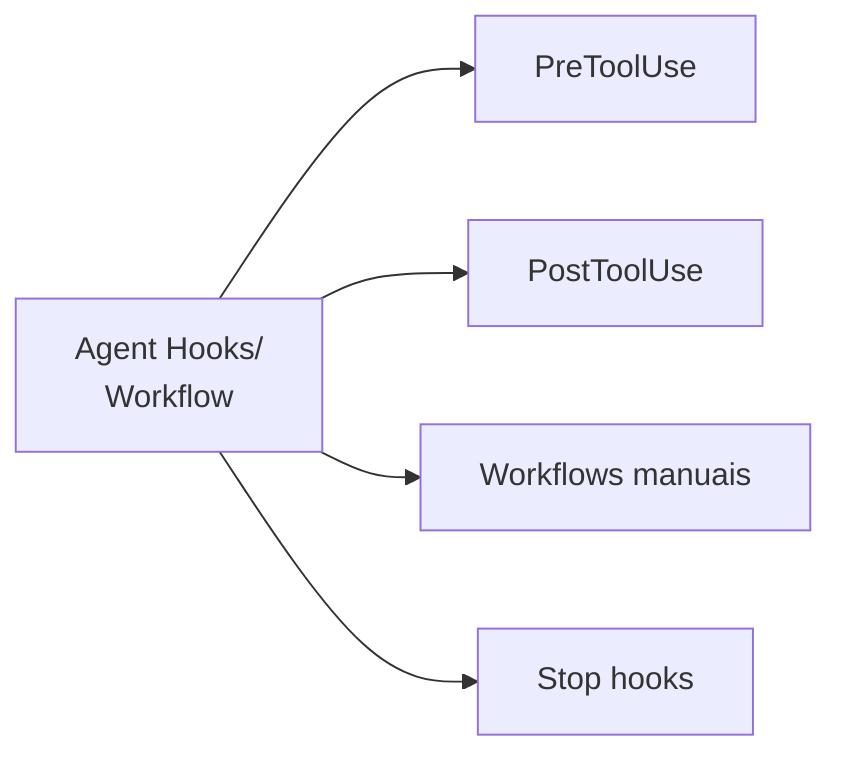

### 7. Orquestração (Coordenação)

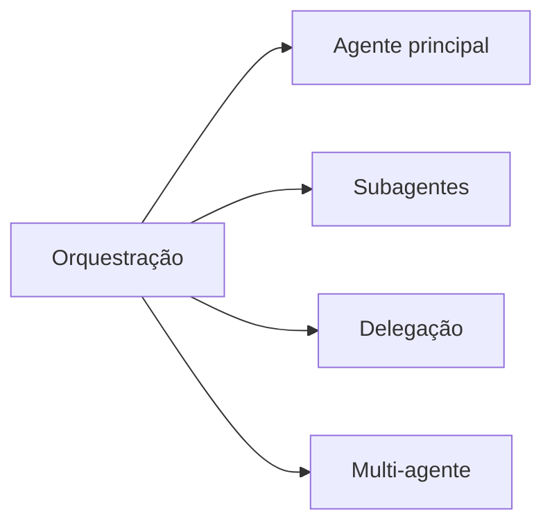

### 8. MCP (Model Context Protocol)

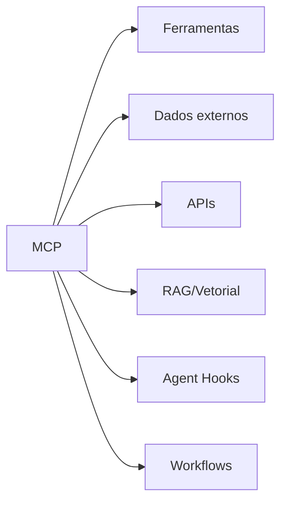

---

## Detalhamento de cada componente

### 1. Modelos/LLMs: Motor de Linguagem

O **modelo** é o cérebro do sistema. É a rede neural treinada com bilhões de parâmetros que processa e gera linguagem.

**Principais modelos (2026):**
- **Claude 4** (Anthropic): Raciocínio avançado, código complexo, multimodal
- **GPT-5** (OpenAI): Versátil, multi-modal, reasoning aprimorado
- **Gemini 3.1** (Google): Integração com ecossistema Google, long context
- **LLaMA 4** (Meta): Open-source, customizável, eficiente

**Características:**
- Tamanho: bilhões a trilhões de parâmetros
- Contexto: 100K-200K tokens
- Custo: cobrado por token (entrada + saída)

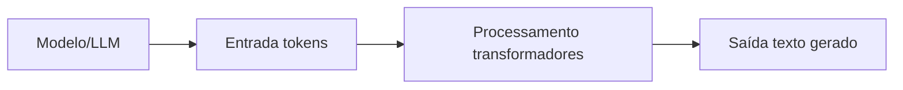

---

### 2. Engenharia de Prompt: Instrução + Contexto

**Prompt** é a entrada que você fornece ao modelo. É como você se comunica com a IA.

**Componentes de um bom prompt:**
1. **Instrução clara:** "Escreva uma função Python que..."
2. **Contexto relevante:** "Você é um assistente especializado em backend..."
3. **Formato esperado:** "Retorne JSON com os campos..."
4. **Exemplos (few-shot):** "Exemplo: entrada X → saída Y"

**Exemplo de prompt estruturado:**
```
Você é um assistente especializado em Python.

Tarefa: Escreva uma função que calcule o fatorial de um número.

Requisitos:
- Use recursão
- Adicione validação de entrada
- Inclua docstring

Formato esperado:
```python
def fatorial(n):
    """Docstring aqui"""
    # implementação
```

**Técnicas:**
- **Zero-shot:** sem exemplos (só instrução)
- **Few-shot:** com 1-5 exemplos
- **Chain-of-thought:** pedir para raciocinar passo a passo

---

### 3. Engenharia de Contexto: Regras/Instruções Fixas

**Contexto** são as instruções permanentes que orientam o comportamento do agente. Diferente do prompt (que muda a cada pergunta), o contexto permanece fixo.

**Componentes:**
1. **Rules (guardrails):** Limites de comportamento
2. **System prompt:** Personalidade/papel do agente
3. **Políticas:** O que pode/não pode fazer
4. **Tom e estilo:** Formal, casual, técnico, etc.

**Exemplo de contexto (system prompt):**
```
Você é um assistente de código especializado em desenvolvimento web.

Regras:
- Sempre escreva código limpo e documentado
- Prefira TypeScript a JavaScript
- Siga princípios SOLID
- Nunca sugira código inseguro

Tom: Técnico, mas acessível. Explique o raciocínio por trás das decisões.
```

**Vantagens:**
- Consistência entre sessões
- Comportamento previsível
- Reduz necessidade de repetir instruções

---

### 4. Skills: Capacidades Reutilizáveis

**Skills** são capacidades modulares que o agente pode executar. Pense em skills como "funções" que o agente sabe fazer.

**Exemplos de skills:**
- **Análise de código:** Revisar código e encontrar problemas
- **Geração de testes:** Criar testes unitários automaticamente
- **Documentação:** Gerar docstrings e READMEs
- **Refatoração:** Melhorar código existente

**Estrutura de uma skill:**
```markdown
Skill: Análise de Código

Entrada: Arquivo de código-fonte
Processo:
1. Ler o código
2. Identificar padrões problemáticos
3. Sugerir melhorias
4. Retornar lista de recomendações

Saída: Lista de melhorias com prioridade
```

**Vantagens:**
- Reutilizável entre projetos
- Testável isoladamente
- Facilita orquestração

---

### 5. Custom Agents: Agentes Especializados

**Custom Agents** são agentes especializados em tarefas específicas. Cada agente tem um papel claro.

**Exemplos:**
- **Code Review Agent:** Revisa código e sugere melhorias
- **Testing Agent:** Cria e executa testes
- **Documentation Agent:** Mantém documentação atualizada
- **Security Agent:** Verifica vulnerabilidades

**Estrutura de um custom agent:**
```
Agent: Code Review Bot

Contexto (fixo):
- Você é um revisor de código sênior
- Foque em: segurança, performance, legibilidade

Skills disponíveis:
- Análise estática
- Detecção de code smells
- Sugestão de refatoração

Modelo: Claude 4

MCP disponível:
- GitHub API (ler PRs)
- Slack (notificar time)
```

**Vantagens:**
- Especialização por domínio
- Contexto otimizado para a tarefa
- Escalabilidade (múltiplos agentes trabalhando em paralelo)

---

### 6. Agentes: Coordenação de Tarefas

**Agentes (orquestração)** são a camada que coordena múltiplos custom agents e decide quem faz o quê.

**Componentes:**
1. **Agente principal (orchestrator):** Recebe tarefa e divide
2. **Subagentes:** Executam partes da tarefa
3. **Delegação:** Decidir qual agente deve fazer cada parte
4. **Orquestração multi-agente:** Coordenar múltiplos agentes em paralelo

**Fluxo de orquestração:**
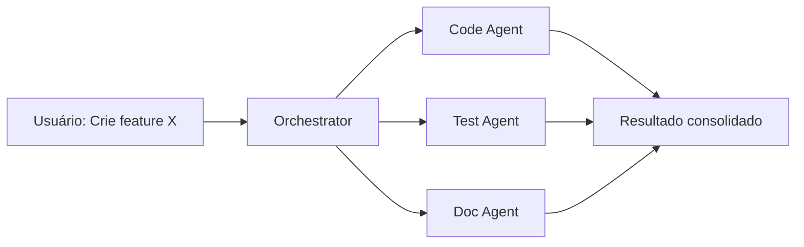

**Vantagens:**
- Paralelização de trabalho
- Especialização por domínio
- Melhor uso de contexto (cada agente tem contexto isolado)

---

### 8. MCP (Model Context Protocol): Conexão com o Mundo

**MCP** é o protocolo padrão para conectar LLMs com ferramentas, APIs e dados externos.

**O que o MCP permite:**
- **Conexão com ferramentas:** Git, Slack, Jira, etc.
- **Acesso a dados externos:** Bancos de dados, APIs REST
- **Integração com APIs:** GitHub, Google Drive, Notion
- **Banco vetorial/RAG:** Busca semântica em documentos privados
- **Agent Hooks:** Pontos de extensão para customização do comportamento
- **Workflows:** Orquestração de tarefas sequenciais ou paralelas

**Estrutura de um MCP:**
```json
{
  "name": "github_mcp",
  "description": "Acesso à API do GitHub",
  "tools": [
    {
      "name": "list_pull_requests",
      "description": "Lista PRs abertos",
      "parameters": {
        "repo": "string",
        "state": "open|closed|all"
      }
    },
    {
      "name": "create_issue",
      "description": "Cria nova issue",
      "parameters": {
        "title": "string",
        "body": "string"
      }
    }
  ]
}
```

**Fluxo com MCP:**
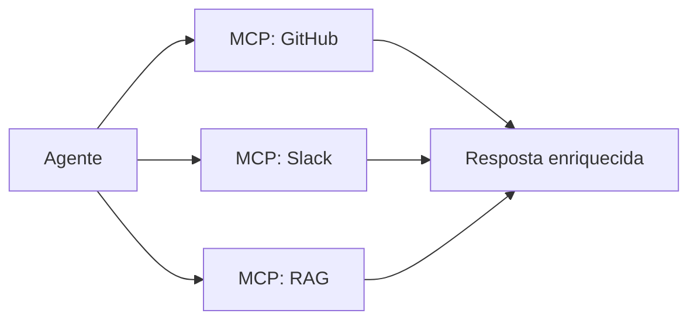

**Vantagens:**
- Padronização entre ferramentas
- Contexto sempre atualizado
- Acesso a dados privados/empresariais
- Reduz alucinações (dados reais, não inventados)

---

### Agent Hooks e Workflows: Sequências de Instruções Recorrentes

Tanto **Agent Hooks** quanto **Workflows** servem para **automatizar sequências de instruções recorrentes**, como verificar qualidade de código, validar padrões de commits, executar testes, ou garantir conformidade com políticas. A diferença está na **forma de ativação**:

---

**Agent Hooks (Ativação Automática):**

Executam automaticamente em **eventos específicos** do ciclo de vida do agente:

- **AgentSpawn:** Quando agente é iniciado (ex: carregar configurações)
- **UserPromptSubmit:** Antes de processar prompt do usuário (ex: validar entrada)
- **PreToolUse:** **Antes** de executar ferramenta (ex: verificar permissões, validar código antes de commit)
- **PostToolUse:** **Depois** de executar ferramenta (ex: formatar código, executar linter)
- **Stop:** Ao final de cada turno (ex: compilar, rodar testes)

**Características:**
- **Ativação:** Automática (reativa a eventos)
- **Formato:** Scripts executáveis (Python, Shell, etc.)
- **Pode bloquear:** Sim (exit code 2 cancela ação)
- **Uso típico:** Validação, segurança, formatação automática

**Exemplo de hook - Validar commit:**
```python
# PreToolUse hook para git commit
def validate_commit(tool_input):
    commit_message = tool_input.get("message", "")
    
    # Verifica padrão: tipo(escopo): mensagem
    if not re.match(r'^(feat|fix|docs|style|refactor|test|chore)\(.+\): .+', commit_message):
        print("ERRO: Commit deve seguir padrão 'tipo(escopo): mensagem'", file=sys.stderr)
        sys.exit(2)  # Bloqueia o commit
```

---

**Workflows (Ativação Manual):**

Executam quando **invocados pelo usuário** via comando `/workflow-name`:

- **Linear:** Executa tarefas em sequência (A → B → C)
- **Paralela:** Executa tarefas simultaneamente
- **Condicional:** Executa baseado em condições
- **Composição:** Pode chamar outros workflows

**Características:**
- **Ativação:** Manual (proativa, usuário decide)
- **Formato:** Markdown com instruções em linguagem natural
- **Pode bloquear:** Não (apenas guia o agente)
- **Uso típico:** Processos de negócio, deploys, análises completas

**Exemplo de workflow - Code review completo:**
```yaml
workflow: code_review
description: Análise completa de PR com checklist de qualidade

steps:
  - name: fetch_pr
    instruction: "Buscar PR do GitHub"
    tool: github.get_pull_request
  
  - name: analyze_parallel
    instruction: "Executar análises em paralelo"
    parallel:
      - security_check: "Verificar vulnerabilidades conhecidas"
      - style_check: "Validar padrões de código (ESLint/Prettier)"
      - test_coverage: "Verificar cobertura de testes (mín 80%)"
      - performance: "Analisar impacto de performance"
  
  - name: consolidate
    instruction: "Consolidar resultados em relatório"
  
  - name: post_comment
    instruction: "Postar comentário no PR com recomendações"
    tool: github.post_comment
```

---

**Comparação: Hooks vs Workflows**

| Aspecto | Agent Hooks | Workflows |
|---------|-------------|-----------|
| **Propósito** | Sequências recorrentes automáticas | Sequências recorrentes manuais |
| **Ativação** | Automática (evento) | Manual (`/workflow-name`) |
| **Formato** | Script executável | Markdown com instruções |
| **Pode bloquear** | Sim (exit code 2) | Não |
| **Exemplo de uso** | Formatar código após edição | Deploy completo de aplicação |
| **Visibilidade** | Transparente (background) | Explícita (usuário invoca) |

**Casos de uso semelhantes:**
- ✅ Validação de qualidade de código
- ✅ Verificação de padrões de commits
- ✅ Execução de testes automatizados
- ✅ Análise de segurança
- ✅ Formatação e linting

**Quando usar cada um:**
- **Hooks:** Quando quer garantir que algo **sempre** aconteça (ex: todo commit deve seguir padrão)
- **Workflows:** Quando quer executar processo **sob demanda** (ex: análise completa de PR apenas quando solicitado)

**Exemplo: Hooks e Workflows trabalhando juntos**

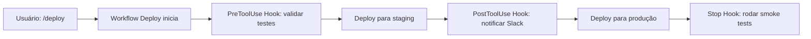

No exemplo acima:
- **Workflow** (`/deploy`): Processo completo de deploy (manual)
- **Hooks**: Validações e notificações automáticas em cada etapa

---

## Resumo: Hierarquia de Componentes

| Componente | O que é | Exemplo | Propósito |
|-----------|---------|---------|-----------|
| **Modelo/LLM** | Motor de linguagem | Claude 4, GPT-5, Gemini 3.1 | Processar e gerar texto |
| **Engenharia de Prompt** | Instrução do usuário | "Crie função que..." | Comunicar com o modelo |
| **Engenharia de Contexto** | Regras fixas | System prompt, policies | Guiar comportamento do agente |
| **Skills** | Capacidades reutilizáveis | Análise de código, testes | Executar tarefas específicas |
| **Custom Agents** | Agentes especializados | Code Review Bot, Test Bot | Especialização por domínio |
| **Agent Hooks/Workflow** | Automação recorrente | PreToolUse, `/deploy` | Sequências automáticas/manuais |
| **Orquestração** | Coordenação de tarefas | Orchestrator, subagentes | Dividir e coordenar trabalho |
| **MCP** | Protocolo de conexão | GitHub MCP, Slack MCP | Acessar ferramentas/dados |

---

## Evolução: 2024 vs 2025

### 2024: Contexto Fixo
- Agente com contexto pré-carregado
- Skills manuais
- MCP básico (só leitura)

### 2025: Contexto Dinâmico (Progressive Disclosure)
- Agentes carregam contexto sob demanda
- Skills modulares e reutilizáveis
- MCP bidirecional (leitura + escrita)
- Orquestração multi-agente

### 2026+: Contexto Adaptativo
- Sistema aprende com uso
- Otimização automática de contexto
- Memória hierárquica (curto/longo prazo)
- Auto-orquestração

**Evolução visual:**

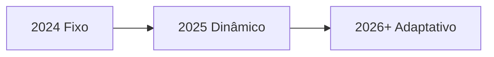

---

## Exemplo Prático: Sistema Completo

Vamos ver como todos os componentes trabalham juntos em um cenário real:

**Cenário:** "Crie uma API REST para gerenciar usuários"

**Fluxo simplificado:**

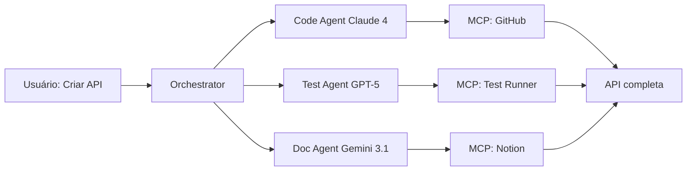

**Passo a passo:**
1. **Prompt:** Usuário pede API REST
2. **Contexto:** Orchestrator sabe que é backend specialist
3. **Orquestração:** Divide em Code + Test + Doc
4. **Skills:** Cada agente usa skill específica
5. **Modelo:** Cada agente usa modelo apropriado (Claude 4 para código complexo, GPT-5 para testes, Gemini 3.1 para docs)
6. **MCP:** Conecta com GitHub, Test Runner, Notion
7. **Resultado:** API funcionando + testes passando + documentação atualizada

---

## Checklist: O que você precisa para começar

✅ **Modelo/LLM:** Escolha Claude 4, GPT-5 ou outro  
✅ **Engenharia de Prompt:** Aprenda a escrever prompts claros  
✅ **Contexto:** Defina rules e system prompt  
✅ **Skills:** Liste capacidades que você precisa  
✅ **Custom Agents:** Crie agentes especializados (opcional se projeto pequeno)  
✅ **Agent Hooks/Workflow:** Configure automações recorrentes (opcional)  
✅ **Orquestração:** Planeje divisão de tarefas (opcional se tarefa simples)  
✅ **MCP:** Configure acessos a ferramentas/dados necessários  

**Mínimo viável:**
- 1 modelo (ex: Claude 4 Sonnet)
- Bons prompts
- 2-3 skills básicas
- 1 MCP (ex: acesso a arquivos)
- Hooks básicos para validação (opcional)

**Ideal (projetos grandes):**
- Múltiplos modelos (Claude 4 para raciocínio complexo, modelos menores para tarefas simples)
- Contexto bem definido com rules
- 10+ skills modulares
- 3+ custom agents especializados
- Hooks para validação automática + workflows para processos
- Orchestrator multi-agente
- 5+ MCPs (GitHub, Slack, banco vetorial, etc.)

---